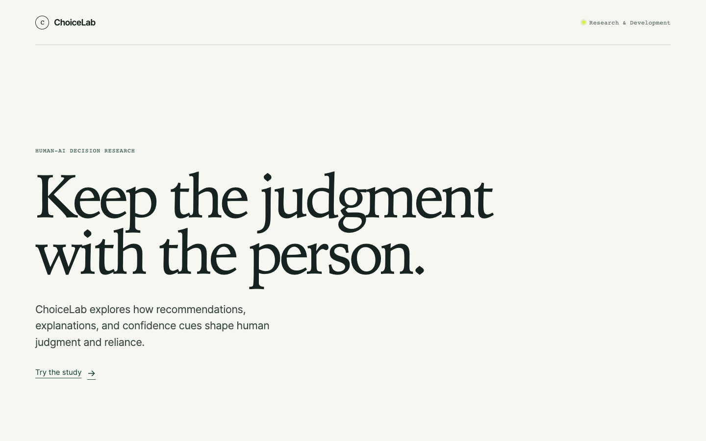
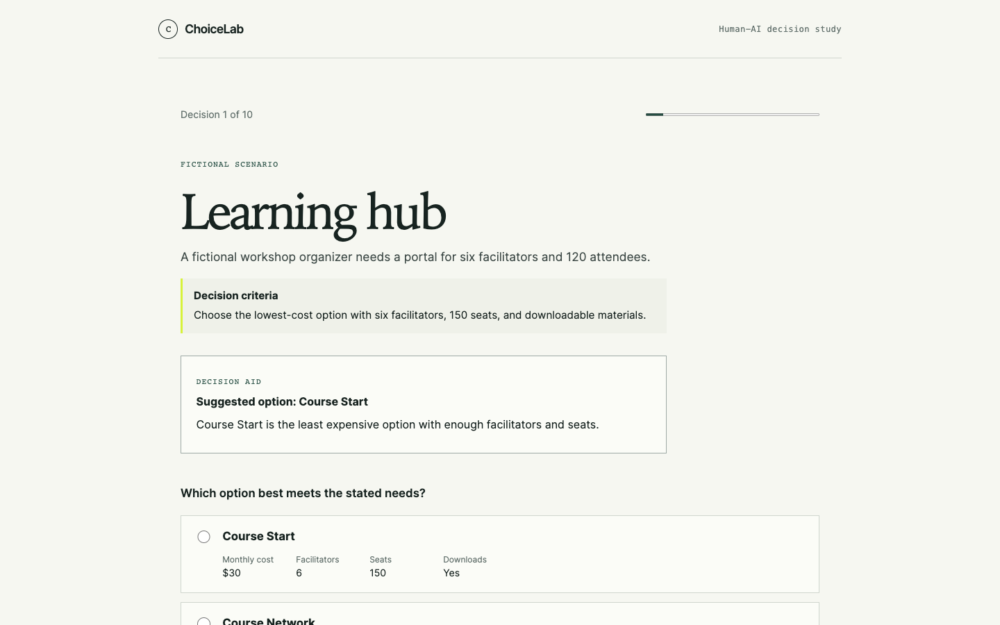
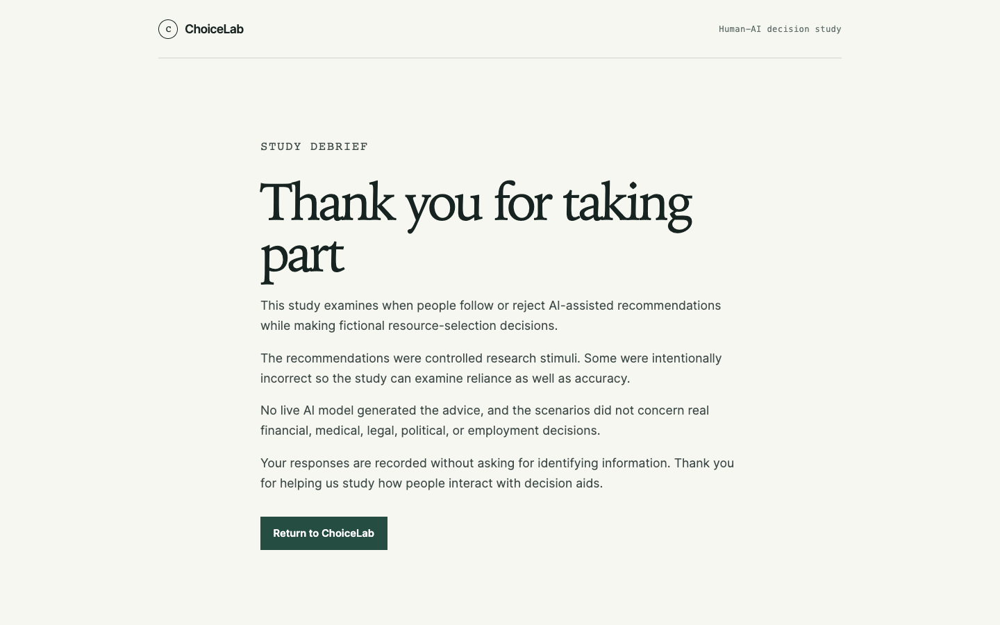

# ChoiceLab

ChoiceLab is a Human-Computer Interaction research platform for studying how AI recommendations, explanations, and confidence cues influence human decision-making and reliance.

It is a controlled human-AI interaction prototype: participants complete fictional, low-risk decision tasks while the backend manages experimental assignment, stimuli, scoring, and anonymous study records. It is not a deployed research study and this repository contains no participant data, findings, or statistical claims.



## Why ChoiceLab

AI interfaces often present recommendations, explanations, and confidence signals. Those choices can shape how much people trust an aid and whether they follow it. ChoiceLab provides a controlled environment for studying those effects while keeping the tasks fictional and the participant in charge of every decision.

## Study Design

Each participant is assigned one of four conditions by the backend:

| Condition           | Participant experience                     |
| ------------------- | ------------------------------------------ |
| `CONTROL`           | Decision task without an AI decision aid.  |
| `AI_RECOMMENDATION` | Suggested option only.                     |
| `AI_EXPLANATION`    | Suggested option with a short explanation. |
| `AI_CONFIDENCE`     | Suggested option with a confidence cue.    |

The study contains ten fictional software and resource-selection trials. Stimuli are versioned and controlled: each complementary schedule includes balanced correct and intentionally incorrect recommendations. Sessions are anonymous, and the backend owns condition assignment and scoring.

## Tech Stack

| Area                | Technologies                                             |
| ------------------- | -------------------------------------------------------- |
| Frontend            | Next.js 16, React 19, TypeScript                         |
| Backend             | FastAPI, Pydantic, Python, SQLite                        |
| Testing and tooling | Pytest, Playwright, ESLint, Prettier, openapi-typescript |

## Architecture

```text
Next.js participant interface
        ↓
FastAPI study service ← controlled, versioned study fixtures
        ↓                    ↑
SQLite persistence ← backend-owned assignment and scoring
```

The browser receives the trial data needed to make a choice, but not answer keys or recommendation-correctness metadata. SQLite is accessed through a repository boundary so the persistence layer can later move to PostgreSQL if the study scope requires it.

## Key Engineering Decisions

- Server-side experimental-condition assignment prevents participants from selecting their own condition.
- Answer keys and recommendation-correctness fields are redacted from trial responses sent to the browser.
- Idempotency keys make response retries safe and prevent duplicate trial advancement.
- Anonymous session records avoid names, contact details, IP addresses, and demographic identity fields.
- Versioned fixtures and complementary schedules keep experimental stimuli deterministic and balanced.
- Researcher summary access is explicitly gated and unavailable by default.
- Semantic controls, visible focus, responsive layouts, and non-color-only cues support accessible participation.

## Screenshots

### AI-assisted trial



### Participant debrief



## Repository Structure

```text
apps/
├── web/                         Next.js participant experience
│   ├── app/study/               Study routes
│   └── components/study/        Participant-facing components
└── api/                         FastAPI study service
    ├── study/                   Assignment, fixtures, scoring, and persistence
    └── tests/                   API and study-integrity tests

docs/
├── assets/                      README screenshots from the local application
├── research/                    Study protocol, data dictionary, and ethics notes
├── design/                      Design requirements and accessibility guidance
└── evaluation/                  Evaluation planning
```

## Local Development

### Frontend

Requirements: Node.js 20.9 or newer and npm.

```bash
npm install
npm run dev
```

The participant interface is served by Next.js at the local URL printed in the terminal.

### Backend

Requirements: Python 3.10 or newer.

```bash
cd apps/api
python3 -m venv .venv
source .venv/bin/activate
pip install -r requirements.txt
uvicorn main:app --reload
```

The API exposes `GET /health` and `GET /v1/project-status`. Study routes live under `/v1/study/`.

## Researcher Summary Configuration

`GET /v1/study/researcher-summary` is disabled by default and excluded from OpenAPI documentation. It returns a 404 unless a local researcher explicitly enables it before starting the API:

```bash
CHOICELAB_ENABLE_RESEARCHER_SUMMARY=true uvicorn main:app --reload
```

Recognized enabled values are `1`, `true`, `yes`, and `on`, case-insensitively. All other values, including an unset value, leave the endpoint unavailable. When enabled, it returns aggregate counts only and is not intended as a public production endpoint.

## Research Integrity

ChoiceLab will not represent assumptions as evidence. The repository does not contain fabricated participants, interview responses, survey data, usability results, or personas. Research findings will be added only when they are collected, analyzed, and documented.

## Roadmap

1. Pilot the controlled study materials with an approved protocol.
2. Review accessibility with relevant assistive technologies.
3. Prepare PostgreSQL deployment only if the study scope requires it.
4. Conduct a documented evaluation.
5. Report findings, limitations, and design iterations responsibly.

## License

ChoiceLab is available under the [MIT License](LICENSE).
